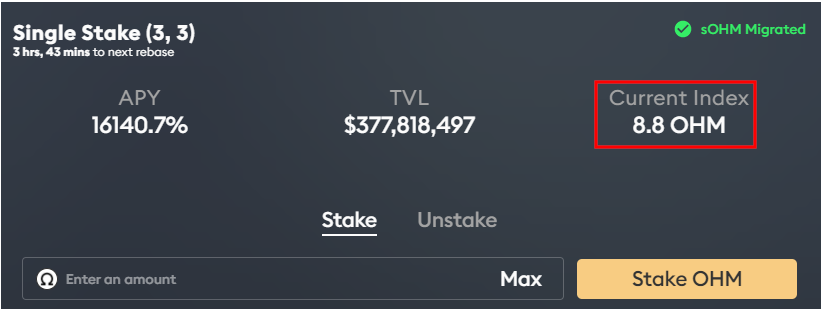

# ΣΥΧΝΕΣ ΕΡΩΤΗΣΕΙΣ

## Γιατί χρειαζόμαστε το OlympusDAO εξαρχής;&#x20;

Τα σταθερά νομίσματα που είναι συνδεδεμένα με δολάρια έχουν γίνει βασικό μέρος των κρυπτονομισμάτων λόγω της έλλειψης μεταβλητότητας σε σύγκριση με τα tokens όπως το Bitcoin και το Ether. Οι χρήστες αισθάνονται άνετα με τη διενέργεια συναλλαγών χρησιμοποιώντας σταθερά νομίσματα γνωρίζοντας ότι κατέχουν το ίδιο ποσό αγοραστικής δύναμης σήμερα σε σχέση με αύριο. Αλλά αυτό είναι μια πλάνη. Το δολάριο ελέγχεται από την κυβέρνηση των ΗΠΑ και την Ομοσπονδιακή Τράπεζα των ΗΠΑ. Αυτό σημαίνει ότι μια υποτίμηση του δολαρίου σημαίνει επίσης μια υποτίμηση αυτών των σταθερών νομισμάτων.&#x20;

Το OlympusDAO στοχεύει να λύσει αυτό το πρόβλημα δημιουργώντας ένα ελεύθερα κυμαινόμενο αποθεματικό νόμισμα, το OHM, το οποίο υποστηρίζεται από ένα καλάθι περιουσιακών στοιχείων. Εστιάζοντας στην αύξηση της προσφοράς και όχι στην ανατίμηση των τιμών, το OlympusDAO ελπίζει ότι το OHM μπορεί να λειτουργήσει ως ένα νόμισμα που είναι σε θέση να διατηρήσει την αγοραστική του δύναμη ανεξάρτητα από τη μεταβλητότητα της αγοράς.

## Είναι το OHM ένα σταθερό νόμισμα;&#x20;

Όχι, το OHM δεν είναι σταθερό νόμισμα. Αντίθετα, το OHM φιλοδοξεί να γίνει ένα αλγοριθμικό αποθεματικό νόμισμα που θα υποστηρίζεται από άλλα αποκεντρωμένα περιουσιακά στοιχεία. Παρόμοια με την ιδέα του κανόνα χρυσού, το OHM παρέχει ελεύθερη κυμαινόμενη αξία στην οποία οι χρήστες του μπορούν πάντα να στηρίζονται, απλά και μόνο λόγω των κλασματικών αποθεματικών του δημοσίου από τα οποία το OHM αντλεί την εσωτερική του αξία.

## Το OHM είναι υποστηριζόμενο, όχι συνδεδεμένο.&#x20;

Κάθε OHM υποστηρίζεται από 1 DAI, δεν είναι συνδεδεμένο με αυτό. Επειδή το ταμείο καλύπτει κάθε OHM με τουλάχιστον 1 DAI, το πρωτόκολλο θα αγοράζει και θα καίει OHM όταν διαπραγματεύεται κάτω από 1 DAI. Αυτό έχει ως αποτέλεσμα να ανεβάζει την τιμή των OHM στο 1 DAI. Το OHM θα μπορούσε πάντα να διαπραγματεύεται πάνω από 1 DAI, επειδή δεν υπάρχει ανώτατο όριο που να επιβάλλεται από το πρωτόκολλο. Σκεφτείτε ότι συνδεδεμένο == 1, ενώ υποστηριζόμενο >= 1.&#x20;

Θα μπορούσατε να πείτε ότι η κατώτατη τιμή του OHM ή η εσωτερική αξία είναι 1 DAI. Εμείς πιστεύουμε ότι η πραγματική τιμή θα είναι πάντα 1 DAI + πριμ, αλλά τελικά αυτό είναι στο χέρι της αγοράς να αποφασίσει.

## Πώς λειτουργεί;&#x20;

Σε υψηλό επίπεδο, το OlympusDAO αποτελείται από το ταμείο που διαχειρίζεται το πρωτόκολλο, τη ρευστότητα που ανήκει στο πρωτόκολλο ([POL](https://docs.olympusdao.finance/main/references/glossary#pol)), το μηχανισμό ομολόγων και τις ανταμοιβές για το κλείδωμα που έχουν σχεδιαστεί για να ελέγχουν την επέκταση της προσφοράς.

Οι πωλήσεις ομολόγων δημιουργούν κέρδος για το πρωτόκολλο και το ταμείο χρησιμοποιεί το κέρδος για να κόβει OHM και να τα διανέμει στους μετόχους. Με τα [ομόλογα ρευστότητας](https://docs.olympusdao.finance/main/references/glossary#liquidity-bonds), το πρωτόκολλο είναι σε θέση να συσσωρεύει τη δική του ρευστότητα. Δείτε το παρακάτω λήμμα σχετικά με [τη σημασία του POL](https://docs.olympusdao.finance/main/basics/basics#why-is-pol-important).

## Τι συμβαίνει με τα (3,3) και (1,1); (

3,3) είναι η ιδέα ότι, αν όλοι συνεργάζονταν στο Olympus, θα προέκυπτε το μεγαλύτερο κέρδος για όλους (από την άποψη της [θεωρίας παιγνίων](https://en.wikipedia.org/wiki/Game\_theory)). Επί του παρόντος, υπάρχουν τρεις ενέργειες που μπορεί να κάνει ένας χρήστης:&#x20;

* Κλείδωμα (+2)&#x20;
* Δέσμευση (+1)&#x20;
* Πώληση (-2)&#x20;

Το κλείδωμα και η δέσμευση θεωρούνται ωφέλιμα για το πρωτόκολλο, ενώ η πώληση θεωρείται επιζήμια. Το κλείδωμα και η πώληση προκαλούν επίσης μια κίνηση των τιμών, ενώ η δέσμευση όχι (θεωρούμε ότι η αγορά OHM από την αγορά αποτελεί προϋπόθεση για το κλείδωμα, προκαλώντας έτσι μια κίνηση των τιμών). Εάν και οι δύο ενέργειες είναι επωφελείς, ο δράστης που μετακινεί την τιμή λαμβάνει επίσης το μισό όφελος (+1). Αν και οι δύο ενέργειες είναι αντιφατικές, ο κακός δράστης που κινεί την τιμή παίρνει το μισό όφελος (+1), ενώ ο καλός δράστης που κινεί την τιμή παίρνει το μισό μειονέκτημα (-1). Εάν και οι δύο ενέργειες είναι επιζήμιες, πράγμα που σημαίνει ότι και οι δύο δρώντες πωλούν, και οι δύο παίρνουν το μισό του μειονεκτήματος (-1).&#x20;

Έτσι, με δεδομένους δύο φορείς, εδώ παρουσιάζονται όλα τα σενάρια για το τι θα μπορούσαν να κάνουν και το αποτέλεσμα στο πρωτόκολλο:

.png>)

* Αν κλειδώσουμε και οι δύο (3, 3), είναι το καλύτερο και για τους δύο και για το πρωτόκολλο (3 + 3 = 6).&#x20;
* Αν ο ένας από εμάς κλειδώσει και ο άλλος δεσμευτεί, είναι επίσης υπέροχο, επειδή το κλείδωμα παίρνει τα OHM από την αγορά και τα βάζει στο πρωτόκολλο, ενώ η δέσμευση παρέχει ρευστότητα και DAI για το ταμείο (3 + 1 = 4).&#x20;
* Όταν ένας από εμάς πουλάει, μειώνει την προσπάθεια του άλλου που κλειδώνει ή δεσμεύει (1 - 1 = 0).&#x20;
* Όταν πουλάμε και οι δύο, δημιουργείται το χειρότερο αποτέλεσμα και για τους δύο μας και για το πρωτόκολλο (-3 - 3 = -6).

## Γιατί είναι σημαντικό το PCV;&#x20;

Καθώς το πρωτόκολλο ελέγχει τα κεφάλαια στο ταμείο του, τα OHM μπορούν να κοπούν ή να καούν μόνο από το πρωτόκολλο. Αυτό εγγυάται επίσης ότι το πρωτόκολλο μπορεί πάντα να καλύπτει 1 OHM με 1 DAI. Μπορείτε εύκολα να καθορίσετε τον κίνδυνο της επένδυσής σας, επειδή μπορείτε να είστε σίγουροι ότι το πρωτόκολλο θα αγοράζει επ' αόριστον OHM κάτω από 1 DAI με τα περιουσιακά στοιχεία του θησαυροφυλακίου μέχρι να μην απομείνει κανείς να πουλήσει. Δεν μπορείτε να εμπιστευτείτε την Ομοσπονδιακή Τράπεζα Αποθεμάτων, αλλά μπορείτε να εμπιστευτείτε τον κώδικα.&#x20;

Καθώς το πρωτόκολλο συσσωρεύει περισσότερο PCV, εξασφαλίζεται περισσότερος διάδρομος για τους αναδευτήρες. Αυτό σημαίνει ότι οι μέτοχοι μπορούν να είναι σίγουροι ότι η τρέχουσα APY στοιχηματισμού μπορεί να διατηρηθεί για μεγαλύτερο χρονικό διάστημα, επειδή υπάρχουν περισσότερα κεφάλαια στο ταμείο.

## **​**Γιατί είναι σημαντική η POL;

Το Olympus [κατέχει το μεγαλύτερο μέρος της ρευστότητάς](https://dune.xyz/shadow/Olympus-\(OHM\)) της χάρη στο μηχανισμό ομολόγων της. Αυτό έχει πολλά πλεονεκτήματα:

* Το Olympus δεν χρειάζεται να καταβάλει υψηλές ανταμοιβές απόδοσης καλλιέργειας για να δώσει κίνητρα στους παρόχους ρευστότητας ή αλλιώς ενοικίασης ρευστότητας.
* Το Olympus εγγυάται στην αγορά ότι η ρευστότητα είναι πάντα εκεί για να διευκολύνει τη συναλλαγή πώλησης ή αγοράς.
* Όντας ο μεγαλύτερος πάροχος ρευστότητας, εισπράττει το μεγαλύτερο μέρος των προμηθειών που αποτελούν άλλη μια πηγή εσόδων για το ταμείο.
*   Όλα τα POL μπορούν να χρησιμοποιηθούν για την υποστήριξη του OHM. Τα LP tokens έχουν υποτιμηθεί στην αξία τους χωρίς κίνδυνο για το σκοπό αυτό. Μπορείτε να διαβάσετε περισσότερα για το σκεπτικό πίσω από αυτό σε αυτό το

    Medium άρθρα

## Τι θα συμβεί αν γίνει μαζική ανάληψη στο Olympus;

Η τραπεζική με κλασματικά αποθεματικά λειτουργεί επειδή οι καταθέτες δεν αποσύρουν τα κεφάλαιά τους όλα μαζί. Η πίστη των καταθετών στο τραπεζικό σύστημα στηρίζεται σε κανονισμούς και οργανισμούς όπως η Ομοσπονδιακή Εταιρεία Ασφάλισης Καταθέσεων (FDIC).&#x20;

Η OHM δεν έχει ασφάλιση FDIC, αλλά διαθέτει μια δομή κινήτρων που προστατεύει τους επενδυτές. Ας ρίξουμε μια ματιά στο πώς αποδίδει κατά τη διάρκεια μιας υποθετικής μαζικής ανάληψης. Σε αυτό το σενάριο, υποθέτουμε ότι η πλειονότητα των μετόχων θα πανικοβαλλόταν και θα αποδέσμευε τα token τους από το Olympus - το ποσοστό στοιχηματισμού που βρίσκεται στο 92% καταρρέει τώρα γρήγορα στο 3,3%, αφήνοντας μόνο 55.000 OHM κλειδωμένα.&#x20;

Στη συνέχεια, υποθέτουμε ότι οι εισροές της Αξίας Χωρίς Κίνδυνο (RFV) προς το ταμείο στερεύουν εντελώς. Για λόγους συγκυρίας, η RFV αυξάνεται επί του παρόντος με [περίπου 1 εκατ. δολάρια κάθε 2 ημέρες](https://dune.xyz/queries/29153/58862). Ωστόσο, κατά τη διάρκεια μιας μαζικής ανάληψης η αύξηση αυτή θα σταματήσει.&#x20;

Τέλος, υποθέτουμε ότι οι τελευταίοι που έμειναν όρθιοι αγόρασαν σε τιμή 500 δολάρια ανά OHM. Η αρχική επένδυση αυτών των μετόχων θα ήταν:&#x20;

$$
$500/OHM * 55,000\ OHM = $27.5\ million
$$

Από τις 15 Σεπτεμβρίου 2021, η συνολική προμήθεια OHM είναι 2.082.553 και η RFV είναι 47.041.833 δολάρια. Να θυμάστε ότι 1 OHM υποστηρίζεται από 1 USD (DAI ή FRAX). Αφαιρώντας αυτούς τους δύο αριθμούς, γνωρίζουμε ότι 44.959.280 OHM θα εκδοθούν τελικά στους εναπομείναντες μετόχους. Σε περίπου ένα χρόνο, αυτοί οι μέτοχοι που κατέχουν 55.000 OHM θα έχουν:&#x20;

$$
55,000 + 44,959,280 = 45,014,280\ OHM
$$

Η επένδυση των 27,5 εκατομμυρίων δολαρίων που έκαναν αυτοί οι μέτοχοι θα μετατραπεί σε περίπου 45 εκατομμύρια δολάρια με βάση μόνο τις ταμειακές ροές, αν παραμείνουν στοιχηματισμένοι (υπενθυμίζουμε ότι 1 OHM υποστηρίζεται από 1 USD). Σε αυτό το σενάριο μαζικής ανάληψης, οι μέτοχοι που παραμένουν κλειδωμένοι όχι μόνο παίρνουν πίσω τα χρήματά τους, αλλά και αποκομίζουν κάποιο κέρδος. Επομένως, το [(3,3)](https://docs.olympusdao.finance/main/basics/basics#what-is-the-deal-with-3-3-and-1-1) δεν είναι απλώς ένα δημοφιλές μιμίδιο, αλλά στην πραγματικότητα μια κυρίαρχη στρατηγική.&#x20;

Το παραπάνω σενάριο είναι απίθανο να πραγματοποιηθεί, διότι όταν άλλοι άνθρωποι ανακαλύψουν ότι καταβάλλονται εξαιρετικά υψηλές ανταμοιβές στους μετόχους, θα αντιγράψουν τη στρατηγική αγοράζοντας και στοιχηματίζοντας OHM. Αυτός είναι επίσης ο λόγος για τον οποίο το ποσοστό των OHM που έχουν τοποθετηθεί στο Olympus παραμένει σταθερά πάνω από 90% από την έναρξη της κυκλοφορίας.&#x20;

_Σημείωση: Τα περισσότερα από τα δεδομένα που αναφέρονται παραπάνω προέρχονται από_ [_αυτή τη σελίδα της Dune Analytics_](https://duneanalytics.com/shadow/Olympus-\(OHM\))_._

## Γιατί η τιμή αγοράς της OHM είναι τόσο ευμετάβλητη;&#x20;

Είναι εξαιρετικά σημαντικό να κατανοήσετε πόσο νωρίς στην ανάπτυξη βρίσκεται το πρωτόκολλο OlympusDAO. Ένα μεγάλο μέρος της συζήτησης έχει επικεντρωθεί γύρω από την τρέχουσα τιμή και την αναμενόμενη σταθερή τιμή που κινείται προς τα εμπρός. Η πραγματικότητα είναι ότι αυτά τα χαρακτηριστικά δεν έχουν ακόμη καθοριστεί. Το δίκτυο είναι προς το παρόν ρυθμισμένο για την επέκταση της προσφοράς OHM, η οποία σε συνδυασμό με τους μηχανισμούς κλειδώματος, δέσμευσης και απόδοσης του OlympusDAO έχουν ως αποτέλεσμα μια αρκετά μεγάλη μεταβλητότητα.&#x20;

Το OHM θα μπορούσε να διαπραγματεύεται σε πολύ υψηλή τιμή, επειδή η αγορά είναι έτοιμη να πληρώσει ένα ισχυρό premium για να κατακτήσει ένα ποσοστό της τρέχουσας κεφαλαιοποίησης της αγοράς. Ωστόσο, η τιμή του OHM θα μπορούσε επίσης να πέσει σε μεγάλο βαθμό εάν το κλίμα της αγοράς γίνει πτωτικό. Θα περιμέναμε σημαντική μεταβλητότητα των τιμών κατά τη φάση της ανάπτυξής μας, οπότε παρακαλούμε **να κάνετε τη δική σας έρευνα** για το αν αυτό το έργο ταιριάζει στους στόχους σας.

## Ποιο είναι το νόημα της αγοράς του τώρα, όταν το OHM διαπραγματεύεται με πολύ υψηλό premium;&#x20;

Όταν αγοράζετε και κλειδώνετε OHM, καταλαμβάνετε ένα ποσοστό της προσφοράς (market cap) το οποίο θα παραμείνει σχεδόν σταθερό. Αυτό οφείλεται στο γεγονός ότι το υπόλοιπό σας σε OHM που έχετε κλειδώσει αυξάνεται επίσης μαζί με την κυκλοφορούσα προσφορά. Το συμπέρασμα είναι ότι αν αγοράζετε OHM όταν η κεφαλαιοποίηση της αγοράς είναι χαμηλή, θα αιχμαλωτίσετε μεγαλύτερο ποσοστό της κεφαλαιοποίησης της αγοράς.

## Τι είναι το rebase;&#x20;

Το Rebase είναι ένας μηχανισμός με τον οποίο το υπόλοιπο των OHM που έχετε κλειδώσει αυξάνεται αυτόματα. Όταν νέα OHM κόβονται από το πρωτόκολλο, ένα μεγάλο μέρος τους πηγαίνει στους μετόχους. Επειδή οι μέτοχοι βλέπουν μόνο το υπόλοιπο των κλειδωμένων OHM αντί των OHM, το πρωτόκολλο χρησιμοποιεί τον μηχανισμό rebase για να αυξήσει το υπόλοιπο των κλειδωμένων OHM, έτσι ώστε 1 κλειδωμένο OHM να είναι πάντα εξαργυρώσιμο για 1 OHM.

## Ποια είναι η απόδοση ανταμοιβής;&#x20;

Η απόδοση ανταμοιβής είναι το ποσοστό κατά το οποίο αυξάνεται το κλειδωμένο υπόλοιπο OHM στην επόμενη εποχή. Είναι επίσης γνωστό ως ποσοστό επαναφοράς. Μπορείτε να βρείτε αυτόν τον αριθμό στη [σελίδα κλειδώματος του Olympus](https://app.olympusdao.finance/#/stake).

## Τι είναι το APY;&#x20;

APY σημαίνει ετήσια ποσοστιαία απόδοση. Μετρά το πραγματικό ποσοστό απόδοσης του κεφαλαίου σας λαμβάνοντας υπόψη την επίδραση του ανατοκισμού των τόκων. Στην περίπτωση του OlympusDAO, το κλειδωμένο σας OHM αντιπροσωπεύει το κεφάλαιό σας και ο ανατοκισμός προστίθεται περιοδικά σε κάθε εποχή (2200 block Ethereum, ή περίπου 8 ώρες) χάρη στον μηχανισμό rebase.

Ένα ενδιαφέρον γεγονός σχετικά με το APY είναι ότι το υπόλοιπό σας δεν θα αυξάνεται γραμμικά αλλά εκθετικά με την πάροδο του χρόνου! Υποθέτοντας έναν ημερήσιο ανατοκισμό 2%, αν ξεκινήσετε με υπόλοιπο 1 OHM την 1η ημέρα, μετά από ένα χρόνο, το υπόλοιπό σας θα αυξηθεί σε περίπου 1377. Αυτό είναι πολύ!

.png>)

## Πώς υπολογίζεται το APY;&#x20;

Το APY υπολογίζεται από την απόδοση ανταμοιβής (ή αλλιώς rebase rate) χρησιμοποιώντας την ακόλουθη εξίσωση:&#x20;

$$
APY = ( 1 + rewardYield )^{1095}
$$

Αυξάνεται στη δύναμη του 1095 επειδή η επαναφορά γίνεται 3 φορές την ημέρα. Αν θεωρήσουμε ότι το έτος έχει 365 ημέρες, η συχνότητα επαναφοράς είναι 365 \* 3 = 1095.&#x20;

Η απόδοση ανταμοιβής καθορίζεται από την ακόλουθη εξίσωση:&#x20;

$$
rewardYield = OHM_{distributed} / OHM_{totalStaked}
$$

Ο αριθμός των OHM που διανέμονται στο συμβόλαιο κλειδώματος υπολογίζεται από τη συνολική προσφορά OHM χρησιμοποιώντας την ακόλουθη εξίσωση:&#x20;

$$
OHM_{distributed} = OHM_{totalSupply} \times rewardRateOHMdistributed​=OHMtotalSupply​×rewardRate
$$

Σημειώστε ότι το ποσοστό ανταμοιβής υπόκειται σε αλλαγές από το πρωτόκολλο. Για παράδειγμα, έχει αναθεωρηθεί λόγω αυτής της [τελευταίας πρότασης](https://forum.olympusdao.finance/d/77-oip-18-reward-rate-framework-and-reduction).

## Γιατί η τιμή του OHM καθίσταται άσχετη μακροπρόθεσμα;&#x20;

Όπως απεικονίζεται παραπάνω, το υπόλοιπό σας OHM θα αυξηθεί εκθετικά με την πάροδο του χρόνου χάρη στη δύναμη του ανατοκισμού. Ας υποθέσουμε ότι αγοράζετε ένα OHM για $400 τώρα και η αγορά αποφασίζει ότι σε 1 χρόνο, η εσωτερική αξία του OHM θα είναι $2. Υποθέτοντας ένα ημερήσιο επιτόκιο ανατοκισμού 2%, το υπόλοιπό σας θα αυξηθεί σε περίπου 1377 OHM μέχρι το τέλος του έτους, το οποίο αξίζει περίπου $2754. Αυτό είναι ένα δροσερό κέρδος $2354! Μέχρι τώρα, θα πρέπει να καταλάβετε ότι πληρώνετε ένα ασφάλιστρο για OHM τώρα με αντάλλαγμα ένα μακροπρόθεσμο όφελος. Συνεπώς, θα πρέπει να έχετε μακρύ χρονικό ορίζοντα για να επιτρέψετε στο υπόλοιπό σας σε OHM να αυξηθεί εκθετικά και να γίνει αυτή μια επένδυση που αξίζει τον κόπο.

## Ποια θα είναι η εσωτερική αξία του OHM στο μέλλον;&#x20;

Δεν υπάρχει σαφής απάντηση για αυτό, αλλά η εσωτερική αξία μπορεί να προσδιοριστεί από την απόδοση του ταμείου. Για παράδειγμα, εάν το ταμείο μπορεί να εγγυηθεί ότι θα καλύψει κάθε OHM με 100 DAI, η εσωτερική αξία θα είναι 100 DAI. Μπορεί επίσης να αποφασιστεί από το DAO. Για παράδειγμα, αν το DAO αποφασίσει να [αυξήσει το κατώτατο όριο τιμής των OHM](https://forum.olympusdao.finance/d/31-use-price-floor-as-tool-for-monetary-policy), η εσωτερική αξία του θα αυξηθεί ανάλογα.

## Πώς καταφέρνει το πρωτόκολλο να διατηρεί το υψηλό APY κλειδώματος;&#x20;

Ας υποθέσουμε ότι το πρωτόκολλο στοχεύει σε ένα εύρος APY από 1,000% έως 10,000% (βλ. [OIP-18](https://forum.olympusdao.finance/d/77-oip-18-reward-rate-framework-and-reduction) για περισσότερες λεπτομέρειες), αυτό θα μεταφραζόταν σε μια ελάχιστη απόδοση ανταμοιβής περίπου 0,2105% ή σε μια ημερήσια αύξηση περίπου 0,6328%. Παρακαλούμε ανατρέξτε στην παραπάνω εξίσωση για να μάθετε [πώς υπολογίζεται το APY από την απόδοση ανταμοιβής](https://docs.olympusdao.finance/main/basics/basics#how-is-the-apy-calculated).

Εάν υπάρχουν 100.000 OHM που έχουν τοποθετηθεί αυτή τη στιγμή, το πρωτόκολλο θα πρέπει να κόψει επιπλέον 632,8 OHM για να επιτευχθεί αυτή η ημερήσια αύξηση. Αυτό είναι εφικτό αν το πρωτόκολλο μπορεί να φέρει τουλάχιστον 632,80 δολάρια ημερήσιων εσόδων από τις πωλήσεις ομολόγων. Ακόμα και αν το πρωτόκολλο δεν φέρει τόσα έσοδα, μπορεί να διατηρήσει το 1.000% APY για σημαντικό χρονικό διάστημα (δείτε για παράδειγμα [το διάγραμμα του διαδρόμου](https://dune.xyz/queries/102766/207436)) λόγω του πλεονάζοντος αποθεματικού στο ταμείο.

## Πρέπει να ξεκλειδώνω και να κλειδώνω τα OHM σε κάθε εποχή για να παίρνω τις ανταμοιβές μου για το rebase;&#x20;

Όχι. Μόλις έχετε ορίσει το OHM με το OlympusDAO, το κλειδωμένο OHM που έχετε ορίσει θα συμπληρώνεται αυτόματα σε κάθε εποχή. Αυτή η αύξηση του υπολοίπου αντιπροσωπεύει τις ανταμοιβές σας για το rebase.

## Πώς μπορώ να παρακολουθώ τις ανταμοιβές rebase μου;&#x20;

Μπορείτε να παρακολουθείτε τις ανταμοιβές rebase υπολογίζοντας την αύξηση του υπολοίπου OHM που έχετε κλειδώσει.&#x20;

1. Καταγράψτε την τιμή του Τρέχοντος δείκτη στη [σελίδα κλειδώματος](./#giati-xreiazomaste-to-olympusdao-eksarxis) όταν κλειδώνετε για πρώτη φορά το OHM σας. Ας ονομάσουμε αυτή την τιμή Δείκτης έναρξης.

1. Αφού κλειδώσετε για κάποιο χρονικό διάστημα, αν θέλετε να προσδιορίσετε κατά πόσο έχει αυξηθεί το υπόλοιπό σας, ελέγξτε ξανά την τιμή του Τρέχοντος δείκτη. Ας ονομάσουμε αυτή την τιμή End Index (Δείκτης τέλους).

.png>)

Διαιρώντας τον Δείκτη τέλους με τον Δείκτη έναρξης, θα λάβετε την αναλογία κατά την οποία έχει αυξηθεί το υπόλοιπο OHM που έχετε κλειδώσει.&#x20;

$$
ratio = endIndex / startIndex
$$

1. Σε αυτό το παράδειγμα, το ισοζύγιο OHM έχει αυξηθεί κατά 1,5 φορές.

$$
ratio = 13.2 / 8.8 =1.5
$$
